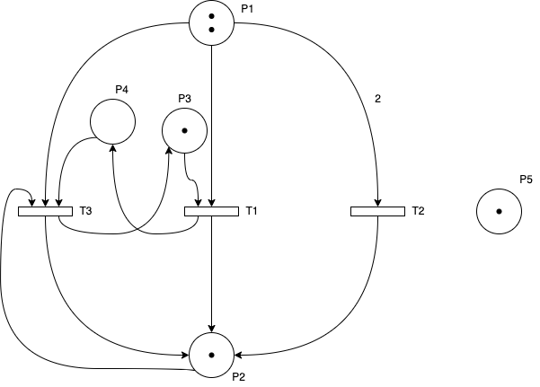
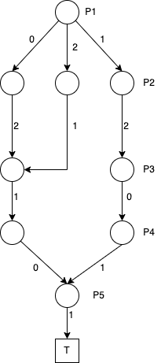
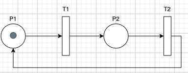
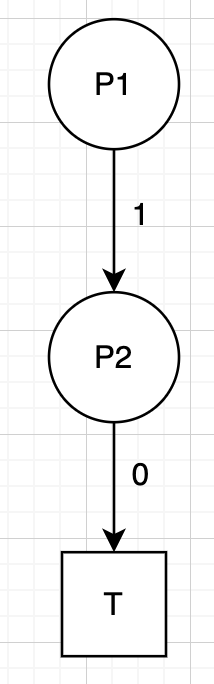
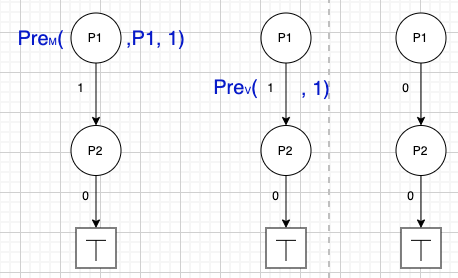
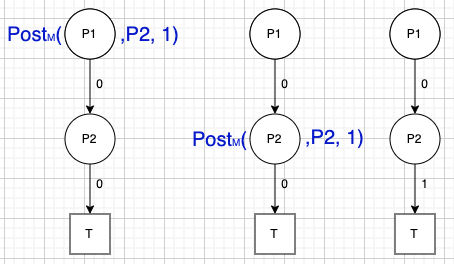
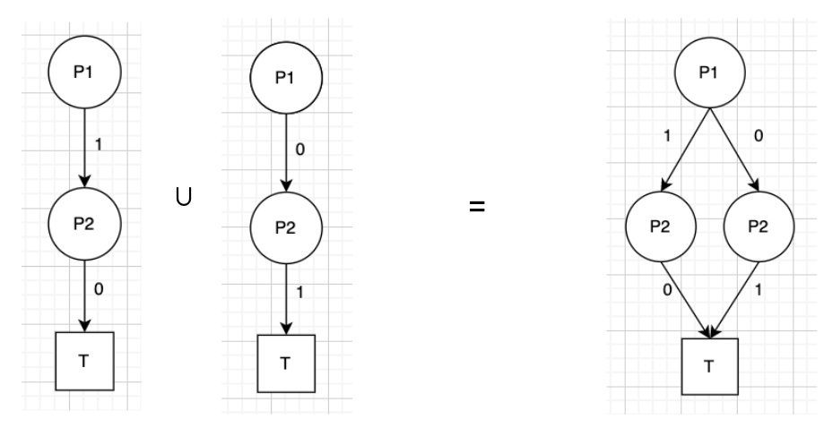
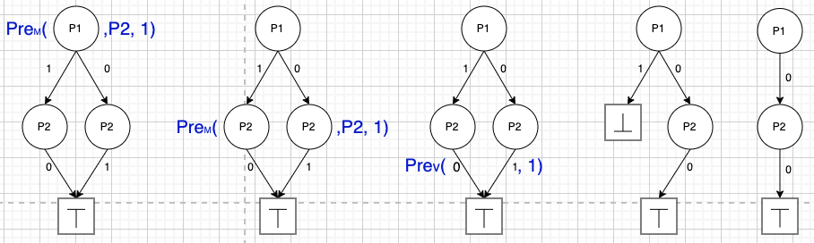
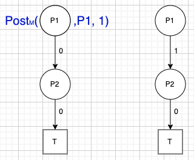
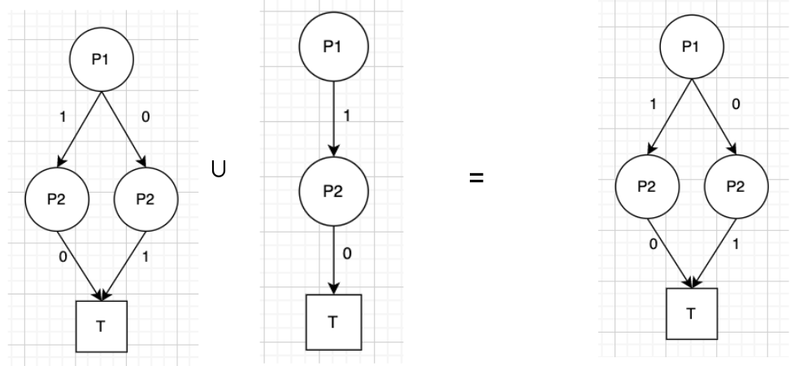

# PetriNet_MFDD
by ARLT Patrick & Rodrigues Jacques

# Context:
This project consists in creating a library that allows to compute the state space of a PetriNet using the MFDD domain. The main advantage of using MFDD is that it computes faster the space domain than using the usual Petri Nets. Indeed, when we fire a transition, we do it for all markings and not just one.

Our MFDDs will contain PetriNet's states: each state (marking) of a PetriNet can be translated into a MFDD. We can then represent a set of states using only one MFDD. This will allow us to represent the state space of a PetriNet with one MFDD only.

To compute the state space, we will convert the initial marking of the PetriNet into a MFDD, and then fire all transitions on our MFDD (by using the homomorphisms `Filter`, `Pre` and `Post`) until we reach a fix point state which will mean that we have explore all possible state for this PetriNet and then means we have compute the whole state space.


# Theory:
## PetriNet:

A PetriNet is a quadruplet $R = (P, T, In, Out)$ where:
- $P$ is a set of places
- $T$ is a set of transitions
- $In$ is the set of preconditions for all transitions
- $Out$ is the set of postcondition for all transitions 



## MFDD:

Let
- $\mathbb{M}$ the set of MFDD
- $\mathbb{P}$ the set of Place.

$$
\begin{aligned}
    \bot &\in \mathbb{M}\\
    \top &\in \mathbb{M}\\
    < k, \tau > &\in \mathbb{M}\\
    k \in \mathbb{P}, \quad \tau &\in \mathbb{N} \times M\\
\end{aligned}
$$



## Homomorphisms:
### Filter Operation:

$Filter_M \ \textunderscore, \textunderscore, \textunderscore : M \times P \times \mathbb{N} \rightarrow M$

$Filter_V (\textunderscore, \textunderscore), \textunderscore : \mathcal{P}(\mathbb{N} \times M) \times \mathbb{N} \rightarrow \mathcal{P}(\mathbb{N} \times M)$

$$
\begin{aligned}
    Filter_M(\bot, k', n) &= \bot\\
    Filter_M(\top, k', n) &= \top
\end{aligned}
$$

$$
Filter_M(<k,\tau>, k', n) = 
\begin{cases}
    < k, \tau' > &k < k' \land \exists (v_i, \tau[v_i]) \in \tau \  | \  Filter_M(\tau[v_i], k', n) \not = \bot,  \\ \newline
    \bot &k < k' \land \forall (v_i, \tau[v_i])\in \tau \  Filter_M(\tau[v_i], k', n) = \bot \\ \newline
    < k, Filter_V(\tau, n) > &k = k' \land  Filter_V(\tau, n) \not = \lbrace \ \rbrace\\ \newline
    \bot &k = k' \land  Filter_V(\tau, n) = \lbrace \ \rbrace\\ \newline
    < k,\tau> &k > k'
\end{cases}
$$

where $\tau' = \{(v_i,Filter_M(\tau[v_i], k', n)) \  | \  Filter_M(\tau[v_i], k', n) \not = \bot \} \quad \forall (v_i, \tau[v_i]) \in \tau$

$Filter_V(\lbrace \ \rbrace, n) = \lbrace \ \rbrace$

$$
Filter_V(\{(v,m)\} \cup s, n) = 
\begin{cases}
    \{(v,m)\} \cup Filter_V(s, n) &if\ v \geq n\\ \\
    \lbrace \ \rbrace \cup Filter_V(s, n) &else
\end{cases}
$$

### Pre Operation:

$Pre_M \textunderscore, \textunderscore, \textunderscore : M \times P \times \mathbb{N} \rightarrow M$

$Pre_V (\textunderscore, \textunderscore), \textunderscore : \mathcal{P}(\mathbb{N} \times M) \times \mathbb{N} \rightarrow \mathcal{P}(\mathbb{N} \times M)$

$$
\begin{aligned}
    Pre_M(\bot, k', n) &= \bot\\
    Pre_M(\top, k', n) &= \top
\end{aligned}
$$

$$
Pre_M(<k,\tau>, k', n) = \begin{cases}
< k, \tau' > &k < k' \land \exists (v_i, \tau[v_i]) \in \tau \  | \  Pre_M(\tau[v_i], k', n) \not = \bot,  \\ \\
\bot &k < k' \land \forall (v_i, \tau[v_i])\in \tau \  Pre_M(\tau[v_i], k', n) = \bot \\ \\
< k, Pre_V(\tau, n) > &k = k' \land  Pre_V(\tau, n) \not = \lbrace \ \rbrace\\ \\
\bot &k = k' \land  Pre_V(\tau, n) = \lbrace \ \rbrace\\ \\
< k,\tau> &k > k'\end{cases}
$$

$Pre_V(\lbrace \ \rbrace, n) = \lbrace \ \rbrace$ 

$$
Pre_V(\{(v,m)\} \cup s, n) = 
\begin{cases}
    \{(v-n,m)\} \cup Pre_V(s, n) &if\ v \geq n\\ \\
    \lbrace \ \rbrace \cup Pre_V(s, n) &else
\end{cases}
$$

### Post Operation:

$Post_M \textunderscore, \textunderscore, \textunderscore : M \times P \times \mathbb{N} \rightarrow M$

$$
\begin{aligned}
    Post_M(\bot, k', n) &= \bot\\
    Post_M(\top, k', n) &= \top
\end{aligned}
$$

$$
Post_M(<k,\tau>, k', n) = 
\begin{cases}
< k, \tau' > &k < k' \\ 
&\text{where } \tau' = \{(v_i,Post_M(\tau[v_i], k', n))\} \quad \forall (v_i, \tau[v_i]) \in \tau\\ \\
< k, \tau ' > &k = k' \\
&\text{where } \tau' = \{(v_i+n,\tau[v_i])\} \quad \forall (v_i, \tau[v_i]) \in \tau\\ \\
< k,\tau> &k > k'
\end{cases}
$$

### How to fire a transition in the MFDD domain:

$$
currentDD \  \cup \  (Post \  \circ \  Pre (currentDD) )
$$

### How to compute the state space:
To compute the state space, we simply have to fire transitions untill we reach a Fix Point state.


# How to use this Library:
```swift 

// Create a PetriNet

enum P: Place, Hashable, Comparable{
    typealias Content = Int
    
    case p1, p2
    
    public var description: String {
        switch self{
        case .p1:
            return "p1"
        case .p2:
            return "p2"
        }
    }
}

enum T: String, Transition, CustomStringConvertible {
    
    var description: String {
        self.rawValue
    }
    
    case t1, t2
}

let pn = PetriNet<P, T>(
    // t1
    .pre(from: .p1, to: .t1),
    .post(from: .t1, to: .p2),
    
    // t2
    .pre(from: .p2, to: .t2),
    .post(from: .t2, to: .p1)
)

let pn_initMarking: Marking<P> = [.p1: 1, .p2: 0]


// Create the factory:
let facto = MFDDFactory<P, P.Content>()

// Convert it to MFDD:
let pnToMFDD = pn_initMarking.markingToMDFFMarking(facto)

// Compute the state space:
let res = pn.computeStateSpac(facto, pnToMFDD)


// If you want to fire only one transition:
let res = pn.fireMFDD(facto, pnToMFDD, .t1)
```

# Illustration:
Inital PetriNet:



Inital MFDD:



Pre Operation for t1:




Post Operation for t1:



Union of the initial MFDD with the result obtained:



Now let's fire t2: Pre Operation for t2:



Post Operation for t2:



Union with the result obtained:



Finally the computation of the state space will apply this process one more time (fire transition t1 and then t2) but will then figure out that the state space hasn't change from the one obtained above (we reached a fixed point state) and will then conclude that the final result (and so the total state space) is the one we found right above.


